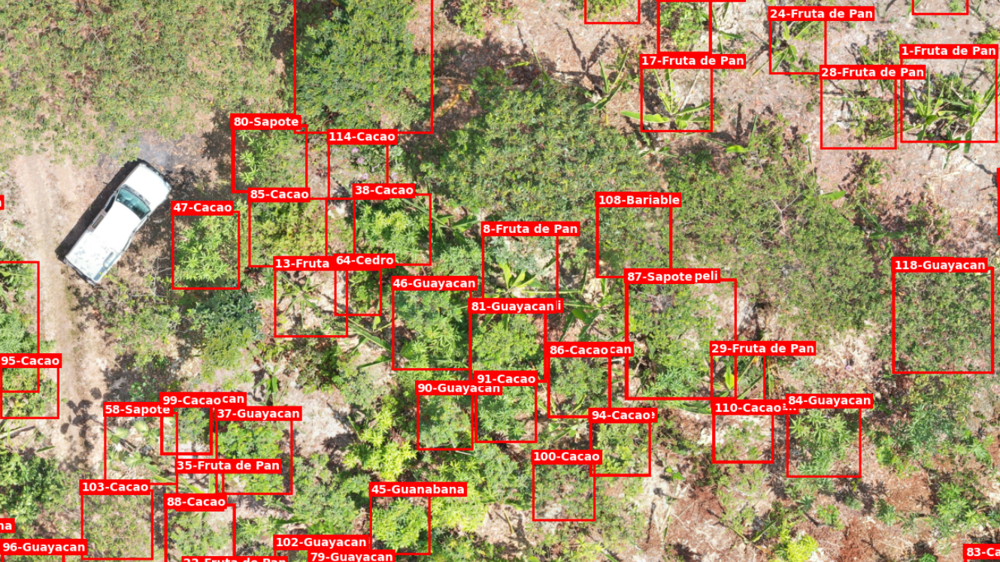
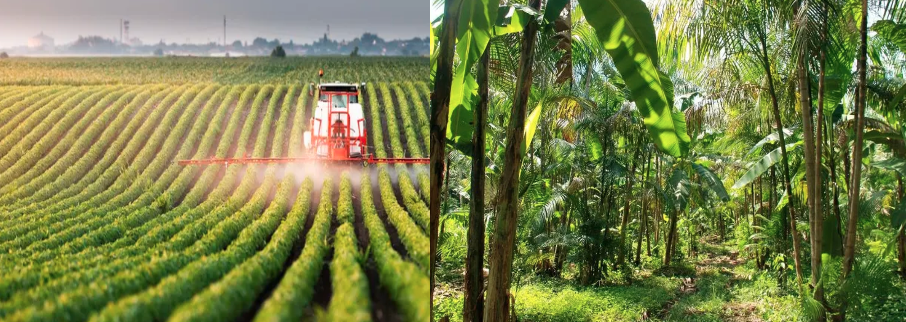
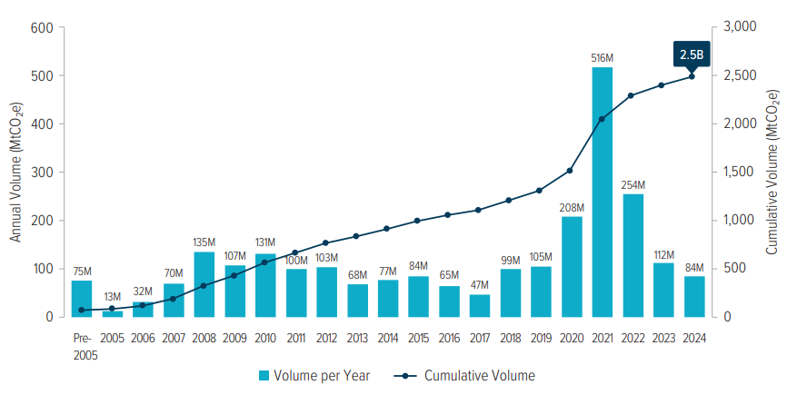
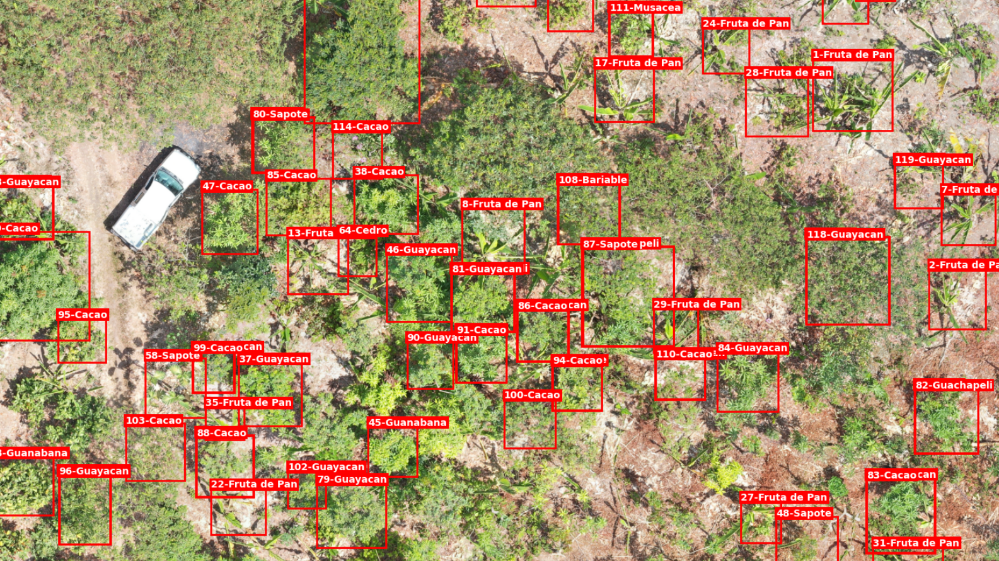
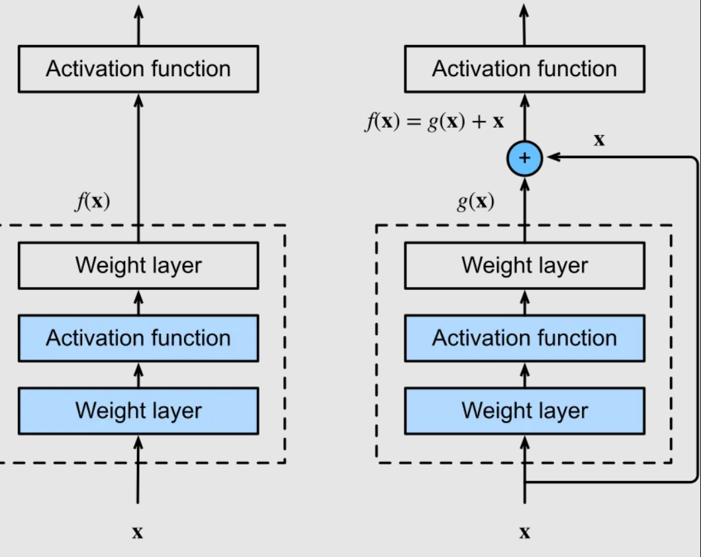
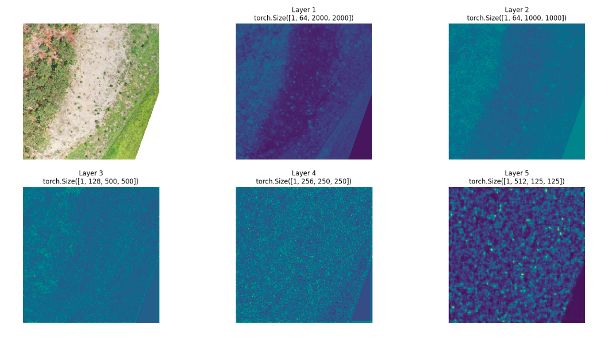
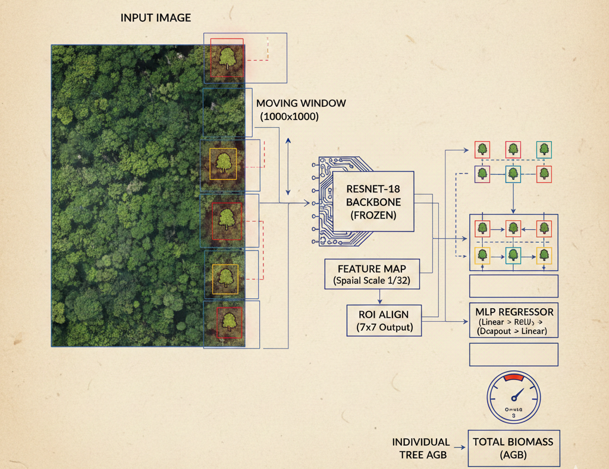
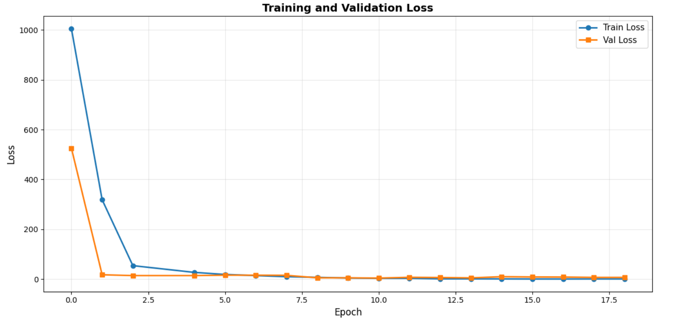
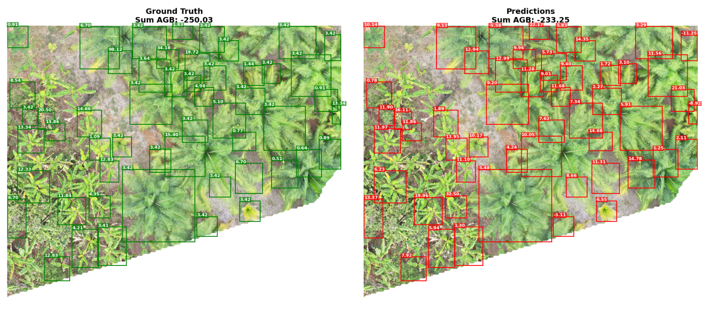

------------------------------------------------------------------------

# Estimating Above Ground Biomass with deep-learning

*Estimating AGB of biodiverse agroforestry sites. An end-to-end guide on how to use deep-learning techniques to estimate above-ground biomass of multiple agroforestry species composing high-productive and ecological plots in Ecuador. Through this tutorial we go through a hands-on session on dataset management, computer-vision skills for object detection and bounding boxes, and feature extraction using pre-trained backbones.*

{fig-align="center"}

------------------------------------------------------------------------

# Context - Hands On Tutorial

This introduction bridges the gap of a hands-on session on how to use deep-learning techniques and state-of-art models to estimate above ground biomass (AGB) within an agroforestry plot. The code of the tutorial can be find [HERE](https://www.kaggle.com/code/emanuelgoulart/abg-dl-regressor "Hands On tutorial") and the [dataset](https://www.kaggle.com/datasets/emanuelgoulart/reforestree-dataset "dataset kaggle") is also full available on kaggle. This tutorial utilizes the dataset developed by Reforestree. Please look the referenced [paper](https://arxiv.org/abs/2201.11192 "original paper") for more information.

## Why Agroforestry & Why It Matters

Modern agriculture faces a fundamental tension: feeding a growing global population while reversing the ecological damage caused by decades of industrial land use. **Agroforestry** offers one of the most promising reconciliations of this tension.

Unlike conventional monoculture systems — where a single crop is grown across vast homogeneous fields at the cost of biodiversity, soil health, and water retention — agroforestry deliberately integrates trees, shrubs, and crops within the same land unit. In the agroforestry plots of coastal Ecuador studied here, cacao grows in the shade of towering timber trees, interspersed with banana, citrus, and fruit species. The result is a system that is simultaneously:

- **Productive**: multi-layered canopies allow year-round harvests of diverse products
- **Ecologically resilient**: diverse root systems stabilize soils and regulate water cycles
- **Carbon-dense**: the standing woody biomass of trees stores large amounts of carbon that would otherwise reside as CO₂ in the atmosphere

This last point — carbon storage — is where the intersection between ecology, remote sensing, and machine learning becomes not just scientifically interesting, but economically and politically consequential.

{fig-align="center"}

------------------------------------------------------------------------

## The Economic and Regulatory Case for Measuring AGB

### Carbon Credits and REDD+

The United Nations **REDD+ framework** (Reducing Emissions from Deforestation and Forest Degradation) creates financial incentives for developing countries and landowners to conserve and restore forests by quantifying and certifying the carbon stored in standing trees. For a REDD+ project to generate tradeable carbon credits, it must demonstrate — with measurable, reportable, and verifiable (MRV) evidence — how much carbon is sequestered in the project area.

**Above Ground Biomass (AGB)** is the primary proxy for carbon stock: approximately 47–50% of dry biomass is carbon. Every megagram of AGB represents roughly 0.5 Mg of stored carbon, or approximately 1.83 Mg of avoided CO₂ equivalent. Without credible AGB measurements, carbon credits cannot be issued, and the entire financial incentive structure for forest conservation collapses.

::: callout-important
## MRV and the Credibility Gap

The credibility of a carbon credit depends entirely on the quality of its underlying measurement. Traditional field inventories — conducted by teams walking plots with diameter tapes and GPS units — are gold-standard accurate but cover only small fractions of project areas. Remote sensing combined with deep learning offers a path to **wall-to-wall AGB estimation** at a fraction of the cost, without sacrificing scientific rigor.
:::

### Bank Loans and Green Finance

Beyond carbon markets, AGB measurements have direct financial implications for **green lending**. Development finance institutions — including the World Bank, the Inter-American Development Bank (IADB), and a growing number of commercial banks with sustainability mandates — increasingly tie loan conditions and concessional interest rates to verified ecosystem service delivery.

A smallholder farmer or cooperative seeking a **green loan** to expand an agroforestry system may be required to demonstrate:

1.  The current carbon stock of their land (baseline AGB)
2.  A credible projection of carbon stock growth under the proposed land management
3.  Periodic re-measurement to verify that the carbon commitment is being honored

Remote sensing-based AGB estimation enables these verifications to be conducted rapidly, cheaply, and at scale — making green finance accessible to landowners who cannot afford repeated field campaigns. In regions like coastal Ecuador, where agroforestry cooperatives manage fragmented plots across hundreds of farms, drone-based AGB mapping could fundamentally unlock access to conservation finance.

### Restoration Carbon Credits

A related and rapidly growing market is **restoration carbon credits** — credits issued not for preserving existing forest but for actively restoring degraded land. Validation of these credits requires demonstrating that planted or regenerating trees are accumulating biomass at the rate projected in the project design document.

This is precisely the use case where the ReforesTree dataset and the techniques demonstrated in this tutorial are most directly applicable: automated, repeatable, drone-based AGB estimation that can track biomass accumulation across agroforestry restoration sites year over year.

------------------------------------------------------------------------

## Framework and Tools

This tutorial will utilize well-spreaded libraries using for the geospatial community. All the code can be accessed in [kaggle](https://www.kaggle.com/code/emanuelgoulart/abg-dl-regressor) or google colab.

### TorchGeo

[TorchGeo](https://torchgeo.readthedocs.io/en/stable/) is a PyTorch library specifically designed for **geospatial machine learning**. It bridges the gap between the geospatial data ecosystem (rasters, shapefiles, CRS-aware projections) and the PyTorch deep learning ecosystem.

TorchGeo provides:

- **Ready-to-use dataset classes** for dozens of publicly available remote sensing datasets, including a `ReforesTree` class that handles download, verification, and loading out of the box
- **Geospatial samplers** for spatially aware train/val splits (avoiding data leakage from spatially autocorrelated data)
- **Transforms** adapted to multi-band satellite and drone imagery (including infrared bands not present in standard RGB datasets)

Its design philosophy is elegant: every dataset returns a dictionary of tensors with consistent keys (`image`, `mask`, `bbox`, etc.), making it easy to swap datasets without changing model code. In this tutorial we subclass `NonGeoDataset` — the appropriate base class for datasets, like our PNG tiles, that do not carry embedded coordinate reference system metadata.

### PyTorch Lightning

[PyTorch Lightning](https://lightning.ai/docs/pytorch/stable/) is the backbone of deep learning training for research and engineering. It separates the **science** (model architecture, loss function, metrics) from the **engineering** (GPU management, gradient accumulation, mixed precision, checkpointing, logging), letting you write cleaner code and iterate faster.

## The ReforesTree Dataset

### Overview

The ReforesTree dataset pairs high-resolution drone imagery with field-measured tree-level annotations across **6 agroforestry sites in coastal Ecuador**. It was introduced by [Gyri Reiersen](https://arxiv.org/search/cs?searchtype=author&query=Reiersen,+G), [David Dao](https://arxiv.org/search/cs?searchtype=author&query=Dao,+D) (2022), and is publicly available on [Zenodo](https://zenodo.org/record/6813783) and through the TorchGeo data loader.

| Attribute | Value |
|------------------------|-----------------------------------------------|
| Number of agroforestry sites | 6 |
| Total image tiles | 100 (4,000 × 4,000 px each) |
| Ground resolution | \~2 cm/pixel |
| Ground area per tile | \~80 × 80 metres |
| Total annotated trees | \> 4,600 |
| Species groups | 6 (banana, cacao, citrus, fruit, timber, other) |

### Study Sites

All six sites are located in the province of Los Ríos and surrounding areas of Ecuador — a region with a tropical climate and a centuries-long tradition of smallholder agroforestry, particularly centered on cacao production.

| Site                | Primary Species       |
|---------------------|-----------------------|
| Carlos Vera Arteaga | Cacao, timber, fruit  |
| Carlos Vera Guevara | Cacao, banana, citrus |
| Carlos Vera Morejón | Mixed agroforestry    |
| Flora Pluas         | Cacao, banana         |
| Nestor Lema         | Timber, fruit         |
| Cardenal            | Mixed agroforestry    |

### Drone Data Collection

Each site was surveyed using a **DJI Phantom 4 Pro** UAV following a pre-planned grid flight path at low altitude. The resulting photographs were processed with photogrammetry to produce georeferenced orthomosaics.

At \~2 cm/pixel, the drone imagery is fine enough to resolve individual tree crowns, canopy gaps, and inter-species textural differences. This resolution is the enabler: it is what makes the visual features extracted by a deep learning backbone informative enough to predict biomass.

For computational tractability, the orthomosaics were tiled into **4,000 × 4,000 pixel PNG patches**, each representing approximately 80 × 80 metres of ground surface.

### Field Inventory

The drone survey was complemented by a comprehensive **tree-by-tree field inventory**. Field teams visited each site and, for every tree within the survey boundary, recorded:

- **Species identity** (both fine-grained species name and coarse group)
- **Diameter at Breast Height (DBH)** — measured with a diameter tape at exactly 1.3 m height above ground
- **GPS coordinates** — recorded at the base of each tree with a handheld device

Each drone imagery patch contains these field and hand-measured tree parameters — breast height measurements and species identification — which led to the calculation of biomass based on aspects and species-related equations derived from **dendrology study**. Thus, this dataset contains, for each tree described within the inventory, an estimation of above ground biomass.

The allometric conversion follows species-specific equations. A widely-used form is:

$$\text{AGB} = 0.0673 \times (\rho \cdot D^2 \cdot H)^{0.976}$$

where $\rho$ is species wood density (g/cm³), $D$ is DBH (cm), and $H$ is tree height (m). The final AGB values, stored in `mapping/final_dataset.csv`, are expressed in **kilograms per tree**.

::: callout-note
## AGB Distribution

The AGB values in this dataset are right-skewed: most trees are young cacao or banana plants with AGB below 50 kg, while a minority of mature timber trees can exceed 500 kg. For model training, AGB is z-score normalized ($\mu \approx 13$ kg, $\sigma \approx 54.5$ kg) to stabilize gradients.
:::

### Bounding Box Annotation

To locate each inventoried tree within the drone imagery, **bounding boxes** were generated using [DeepForest](https://deepforest.readthedocs.io/en/stable/) — a convolutional neural network pre-trained for tree crown detection in aerial imagery. These automatically generated proposals were then **manually reviewed and cleaned** by the dataset authors.

Each bounding box was matched to a field measurement record using **GPS proximity**: the box is assigned to the field-measured tree whose recorded GPS coordinate falls closest to the box centroid. This matching is the main source of label uncertainty in the dataset — GPS receivers in a forest canopy environment can be off by several metres, and not every visible crown has a corresponding field record.

The final annotation CSV contains one row per matched tree, linking: `img_path` → `bbox [xmin, ymin, xmax, ymax]` → `species name` → `group` → `AGB (kg)`

------------------------------------------------------------------------

## Deep Learning Approach

### The ResNet Family and Transfer Learning

Our feature extractor is **ResNet-18**, a member of the Residual Network (ResNet) family introduced by @he2016deep. ResNet models solved a fundamental problem in deep learning: as networks grew deeper to learn more abstract representations, they became increasingly difficult to train due to vanishing gradients. The solution was the **residual (skip) connection** — a shortcut path that adds the input of a block directly to its output, allowing gradients to flow through the network without degradation.

The ResNet family comes in several depth variants:

| Model      | Parameters | ImageNet Top-1 |
|------------|------------|----------------|
| ResNet-18  | 11.7 M     | 69.8%          |
| ResNet-34  | 21.8 M     | 73.3%          |
| ResNet-50  | 25.6 M     | 76.1%          |
| ResNet-101 | 44.5 M     | 77.4%          |

For this task we use **ResNet-18** — the lightest member of the family. With a frozen backbone (no fine-tuning), the parameter count that actually trains is just the MLP head (\~6.6 M parameters), which converges quickly even on a small dataset. The backbone is loaded with weights pretrained on **ImageNet-1k** via `timm`, a large collection of pretrained vision models.

### Visual Embeddings and Latent Space

A pretrained convolutional network is not just a classifier — it is also a **feature extractor**. As an image passes through successive convolutional layers, it is progressively transformed from raw pixel values into increasingly abstract and semantically rich representations.

The output of the final convolutional block — before the classification head — is a tensor of shape `[512, H', W']` where each of the 512 channels activates in response to a different learned visual pattern. This tensor is often called the **feature map**, and the 512-dimensional vector at each spatial location is called a **visual embedding** or **latent representation**.

These embeddings live in a high-dimensional **latent space** where semantically similar regions cluster together: two cacao crowns with similar size and texture will produce similar embeddings, regardless of where they appear in the image or which site they come from.

For the AGB regression task, we want to map each tree's visual embedding, which encodes crown size, texture, color, and shadow, to a biomass value. This is the role of the MLP regression head.

### Architecture: Sparse Feature Regression

The central engineering challenge is that our input images are **4,000 × 4,000 pixels** — far larger than the 224 × 224 pixels ResNet was designed for. Three naive approaches fail:

- **Resize to 224 × 224**: destroys resolution; trees become sub-pixel
- **Uniform tiling**: processes \~256 patches per image, most containing only bare soil
- **Full-image pass**: requires \~12 GB VRAM — exceeds most single-GPU budgets

The solution is a **Sparse Moving Window** strategy:

> Only the 1,000 × 1,000 pixel patches that contain at least one labeled bounding box are forwarded through the backbone. Feature maps from processed patches are assembled into a full-image canvas (zero-filled elsewhere), and RoI Align then extracts per-tree features from this sparse representation.

The complete forward pass has five stages:

| Stage | Operation | Shape |
|------------------------|------------------------|------------------------|
| Input | Drone tile | `[3, 4000, 4000]` |
| Patch selection | Identify bbox-containing windows | — |
| ResNet-18 backbone | Per-patch feature extraction | `[512, 31, 31]` per patch |
| Canvas assembly | Sparse full-image feature map | `[512, 125, 125]` |
| RoI Align | Per-tree 7×7 feature grid | `[N, 512, 7, 7]` |
| MLP head | Biomass regression | `[N, 1]` |
| Aggregation | Tile-level sum | `[1]` |

**RoI Align** (@he2017mask) deserves particular attention. It maps each bounding box (defined in pixel coordinates) to the feature map (at 1/32 resolution) and extracts a fixed 7 × 7 feature grid using bilinear interpolation. This normalizes the representation across tree crowns of very different physical sizes — a critical property for a dataset spanning cacao seedlings and mature timber trees.

### The Global Aggregation Loss

Rather than computing a per-tree MSE between each individual prediction $\hat{y}_i$ and its ground-truth label $y_i$, the training objective is:

$$\mathcal{L} = \text{MSE}\!\left(\sum_{i \in \mathcal{V}} \hat{y}_i,\;\sum_{i \in \mathcal{V}} y_i\right)$$

where $\mathcal{V}$ is the set of trees whose patches were processed in a given forward pass. This is a deliberate design choice:

- **Individual labels carry GPS uncertainty**: the bounding box matched to a field record may belong to a neighboring tree in the image
- **Area-wide sums are more robust**: individual errors cancel out when aggregated, producing a more stable training signal
- **Ecological relevance**: carbon accounting is done at plot or site level, not per individual tree

### Training Configuration

| Parameter | Value | Rationale |
|------------------------|------------------------|------------------------|
| Backbone | ResNet-18 (frozen) | Small dataset; pretrained features sufficient |
| Optimizer | Adam | Adaptive learning rate |
| Learning rate | 1e-4 | Standard for regression heads |
| Batch size | 1 | Memory constraint (one 4K×4K tile ≈ 180 MB) |
| Gradient accumulation | 4 | Effective batch size = 4 |
| Epochs | 18 | Convergence plateau observed \~epoch 12 |
| Precision | 16-mixed (AMP) | \~2× throughput on modern GPUs |

### Results

Training converges steadily over 18 epochs with the validation loss closely tracking training loss, indicating the model generalizes across sites rather than memorizing a single agroforestry structure.

The best checkpoint achieves `val_loss ≈ 4.39` on normalized MSE. Converting to physical units:

$$\text{RMSE}_{\text{raw}} = \sqrt{4.39} \times 54.5 \;\text{kg} \approx 114 \;\text{kg per tile}$$

For context, a typical tile contains 20–60 labeled trees with a total AGB sum in the range of 500–3,000 kg. A tile-level RMSE of \~114 kg represents relative errors on the order of 5–20%, which is competitive with the inherent GPS-matching uncertainty in the ground truth labels.

------------------------------------------------------------------------

## Next Steps and Future Directions

This [tutorial](https://www.kaggle.com/code/emanuelgoulart/abg-dl-regressor#Feature-Space---Plot) demonstrates that a frozen pretrained backbone combined with a lightweight MLP head can produce meaningful AGB estimates from drone imagery — without any fine-tuning of the CNN weights. Several directions could push this further:

**Backbone fine-tuning** Unfreeze the later ResNet layers after an initial warm-up phase. With a low learning rate and careful regularization (e.g., layer-wise learning rate decay), fine-tuning the convolutional features on drone imagery could capture domain-specific textures not present in ImageNet.

**Backbone scaling** Replace ResNet-18 with a larger member of the family (ResNet-50, ResNet-101) or a Vision Transformer (ViT). Larger models produce richer embeddings at the cost of higher VRAM requirements — manageable with the sparse window strategy already in place.

**Multi-spectral input** Drone surveys increasingly include near-infrared (NIR) bands alongside RGB. The Normalized Difference Vegetation Index (NDVI = (NIR − Red) / (NIR + Red)) is a strong proxy for canopy health and correlates with biomass. Adding NIR as a fourth input channel (with corresponding adjustments to the first convolutional layer) is a natural extension.

**Per-tree loss with uncertainty weighting** Replace the global sum loss with a per-tree Huber loss, weighting each tree's contribution by an uncertainty estimate derived from GPS accuracy metadata. This would allow the model to focus learning on high-confidence annotations.

**Spatial cross-validation** The current random 70/15/15 split ignores spatial autocorrelation — tiles from the same site end up in both train and test. A site-level leave-one-out evaluation would give a more honest estimate of generalization to new farms and geographies.

**Temporal monitoring** The most impactful real-world application is **repeated biomass mapping over time**. Flying the same sites annually and running the pipeline each time would produce biomass change maps suitable for carbon credit verification and green loan reporting.

::: callout-tip
## Get started

The full tutorial notebook is available on Kaggle. You can fork it, add the ReforesTree dataset, and run the entire pipeline end-to-end on a free T4 GPU in under 2 hours.

→ [**View Tutorial Notebook**](AGB_Regressor_DL_presentation.ipynb)  \|  [**Open in Kaggle**](https://www.kaggle.com/code/emanuelgoulart/abg-dl-regressor)  \|  [**GitHub Repository**](https://github.com/emanuel-gf/ReforesTree)
:::

------------------------------------------------------------------------

## References

::: {#refs}
Reiersen, Gyri, David Dao, Björn Lütjens, Konstantin Klemmer, Kenza Amara, Attila Steinegger, Ce Zhang, and Xiaoxiang Zhu. 2024. “ReforesTree: A Dataset for Estimating Tropical Forest Carbon Stock with Deep Learning and Aerial Imagery.” arXiv. <https://doi.org/10.48550/arXiv.2201.11192>
:::